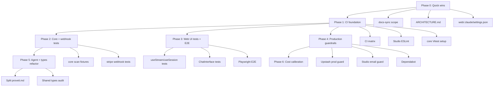

# Plan: Codebase Hardening — CI, Tests, Docs, Production Guardrails

**Date:** 2026-08-02  
**Status:** Proposed — ready to execute  
**Scope:** All items from the 2026-08-02 codebase review (15 workstreams)  
**Base branch:** `feat/proveit-studio` (merge to `main` when complete)

## Why now

ProveIt has three surfaces (plugin, web, Studio) sharing `@proveit/core`. The **web app is production-grade** — 303 passing tests, spend ledger, Stripe checkout — but **Studio and core are CI-blind**, shared parsing logic is untested, docs lag Supabase/Stripe reality, and a few production guardrails are documented-but-not-enforced. This plan closes every gap from the review in dependency order, without changing product behaviour.

## Success criteria (definition of done)

| # | Criterion | Verify with |
|---|-----------|---------------|
| 1 | CI runs lint + typecheck + build + test for `web/`, `studio/`, and `packages/core` | Green PR on all three |
| 2 | `packages/core` has fixture tests for scan/parse/dedup/classify | `npm test` in core |
| 3 | Stripe webhook route has integration tests (sig, idempotency, 500 retry) | vitest in web |
| 4 | Docs-sync covers `studio/src/` + `packages/` + `studio/README.md` | `scripts/check-docs-sync.sh` + CI |
| 5 | `web/ARCHITECTURE.md` reflects Supabase + Stripe; README test count accurate | Manual read |
| 6 | Production fails closed without Upstash env vars | Unit test + env guard |
| 7 | `web/.claude/settings.json` aligned with root security model | No Bash allow-all; relative paths |
| 8 | Studio ESLint non-interactive | `npm run lint` in studio |
| 9 | Hook + component tests for core user journey | vitest count ↑ |
| 10 | Local Playwright E2E (mocked AI) for `/fast` and `/validate` | `npm run e2e` in web |
| 11 | `agents/proveit.md` split into composable includes | Agent runs unchanged |
| 12 | Shared types audit complete; duplication removed or documented | Typecheck both apps |
| 13 | Studio deploy fails if `STUDIO_SOURCE=supabase` without `STUDIO_ALLOWED_EMAIL` | Build/middleware test |
| 14 | Cost calibration logging in spend ledger | Log line per successful call |
| 15 | Dependabot/Renovate enabled; npm audit critical/high triaged | Config file + audit clean or documented exceptions |

---

## Architecture of the work



---

## PR strategy

Ship as **6 stacked PRs** to keep review manageable. Each PR is independently mergeable; later PRs rebase on earlier ones.

| PR | Phase | Branch suffix | Est. files |
|----|-------|---------------|------------|
| 1 | Phase 0 — Quick wins | `hardening-docs` | ~8 |
| 2 | Phase 1 — CI foundation | `hardening-ci` | ~12 |
| 3 | Phase 2 — Core + webhook tests | `hardening-core-tests` | ~20 |
| 4 | Phase 3 — UI tests + E2E | `hardening-ui-e2e` | ~25 |
| 5 | Phase 4 — Production guardrails | `hardening-prod-guards` | ~10 |
| 6 | Phase 5 + 6 — Agent split + calibration | `hardening-agent-types` | ~30 |

Branch naming: `cursor/codebase-hardening-<suffix>-0954`

---

## Phase 0 — Quick wins (no behaviour change)

**Goal:** Align docs and policy before adding CI gates that will enforce them.

### 0.1 Docs-sync scope fix

**Problem:** `AGENTS.md` says `studio/src/` and `packages/` require doc updates; `scripts/check-docs-sync.sh` and the PreToolUse hook only watch plugin dirs + `web/src/`.

**Changes:**

| File | Change |
|------|--------|
| `scripts/check-docs-sync.sh` | Extend `CODE_RE` to `^(scripts/\|agents/\|commands/\|web/src/\|studio/src/\|packages/)`; extend `DOCS_RE` to include `studio/README.md` |
| `.claude/settings.json` | Mirror the same regex in the PreToolUse hook |
| `AGENTS.md` | Confirm the enforced paths match (already correct — no change unless wording drifts) |

**Acceptance:** A PR that changes only `packages/core/src/scan.ts` fails docs-check until a doc is updated.

### 0.2 Update stale web architecture docs

| File | Change |
|------|--------|
| `web/ARCHITECTURE.md` §1 | Replace "no database" with: localStorage for session state; Supabase for waitlist, orders, woz-intent; Stripe for paid bundle |
| `web/ARCHITECTURE.md` | Add `/api/stripe/*`, `/api/waitlist`, `/api/woz-intent` to route inventory if missing |
| `web/README.md` | Test count 303; complete API route tree; mention Supabase + Stripe |

### 0.3 Fix committed dev settings

| File | Change |
|------|--------|
| `web/.claude/settings.json` | Remove Bash allow-all; use relative `$(git rev-parse --show-toplevel)/web` for tsc hook; or gitignore and document in README |
| `README.md` or `web/README.md` | Note that personal Claude settings belong in local override, not committed |

**Decision:** Prefer **fix in place** (relative path, no Bash allow) over gitignore — keeps the advisory tsc hook useful for contributors.

---

## Phase 1 — CI foundation

**Goal:** Nothing in the monorepo can break silently again.

### 1.1 Monorepo CI matrix

Replace single-job `ci.yml` with a matrix (or parallel jobs):

```yaml
jobs:
  web:       # existing — lint, tsc, build, vitest
  studio:    # tsc, build, lint (after 1.2)
  core:      # vitest (after 1.3)
```

**Root considerations:**
- Use `npm ci` at repo root for workspaces, then run per-package scripts
- Studio build needs dummy Supabase env vars (same pattern as web's dummy Anthropic key)
- Cache: root `package-lock.json` + per-package lockfiles if any

| File | Change |
|------|--------|
| `.github/workflows/ci.yml` | Add `studio` and `core` jobs |
| `package.json` (root) | Add `"test": "npm test -ws --if-present"` convenience script |

### 1.2 Studio ESLint

| File | Change |
|------|--------|
| `studio/eslint.config.mjs` | **NEW** — extend or copy from `web/eslint.config.mjs` (Next + TypeScript) |
| `studio/package.json` | Ensure lint script is non-interactive |

### 1.3 Core Vitest setup

| File | Change |
|------|--------|
| `packages/core/package.json` | Add vitest, test script |
| `packages/core/vitest.config.ts` | **NEW** |
| `packages/core/tests/fixtures/` | **NEW** — sample vault markdown |

---

## Phase 2 — Core + webhook tests

**Goal:** Test the highest-risk untested logic — shared parsing and the paid path.

### 2.1 `packages/core` fixture tests

Create fixtures mirroring real vault quirks documented in `scan.ts`:

| Fixture | Tests |
|---------|-------|
| `standard/discovery.md` | Standard naming; full score parse |
| `numbered/01_Discovery.md` | Numbered convention |
| `dedup/00_Index.md` + `discovery.md` | Index loses to real discovery |
| `artifacts/swarm-1-market-bull.md` | `classifyArtifact()` |
| `artifacts/21_Swarm_1_Market_Bull.md` | Numbered artifact |
| `edge/no-scores.md` | Rejected as discovery |
| `edge/nested/deep/discovery.md` | MAX_DEPTH behaviour |

**Test functions:** `discoveryLikelihood`, `parseDiscovery`, `classifyArtifact`, `scanRoots` (temp dir), `slugify`, `combined`, `activeKillCount`, `scanFastChecks`, `parseFastCheckNote`.

| File | Change |
|------|--------|
| `packages/core/tests/scan.test.ts` | **NEW** |
| `packages/core/tests/fast-check.test.ts` | **NEW** |
| `packages/core/tests/fixtures/**` | **NEW** |

### 2.2 Stripe webhook integration tests

Mirror patterns from `web/tests/integration/api-stripe-checkout.test.ts`.

| Case | Expected |
|------|----------|
| Missing `stripe-signature` | 400 |
| Invalid signature | 400 |
| Unconfigured Stripe / secret | 503 |
| `checkout.session.completed` — first delivery | 200, order marked paid, notify called |
| Duplicate delivery | 200, no second notify |
| Processing error in `markOrderPaid` | 500 (Stripe retries) |
| Non-checkout event type | 200, no side effects |

| File | Change |
|------|--------|
| `web/tests/integration/api-stripe-webhook.test.ts` | **NEW** |
| `web/tests/setup.ts` | Mock helpers for Stripe constructEvent if needed |

---

## Phase 3 — Web UI tests + local E2E

**Goal:** Cover the conversational UI path that API tests skip.

### 3.1 Hook tests

| Target | Cases |
|--------|-------|
| `useStream` | 503 global_cap / per_ip_cap sets `errorReason`; AbortError silent; malformed JSON body |
| `useSession` | create, resume, clear, phase persistence |

| File | Change |
|------|--------|
| `web/tests/unit/use-stream.test.tsx` | **NEW** |
| `web/tests/unit/use-session.test.tsx` | **NEW** |

### 3.2 Component tests (priority order)

1. `ChatInterface` — idea validation, resume prompt, phase indicator wiring
2. `FastStream` — stream event → AssumptionCard render
3. `EmailCaptureForm` — shown on spend cap
4. `DownloadButton` — markdown generation trigger

Use `@testing-library/react` + mocked `useStream`/`useSession`.

### 3.3 Local Playwright E2E

| File | Change |
|------|--------|
| `web/playwright.config.ts` | **NEW** |
| `web/tests/e2e/fast-check.spec.ts` | **NEW** — mock `/api/fast` via route interception |
| `web/tests/e2e/validate-flow.spec.ts` | **NEW** — mock `/api/chat` |
| `web/package.json` | `"e2e": "playwright test"` script |
| `.github/workflows/ci.yml` | Optional: e2e job (can start as local-only to avoid CI flakiness) |

**Decision:** Ship E2E as **local + post-merge manual** first; add to CI once stable (same pattern as `.shipit-gates/`).

---

## Phase 4 — Production guardrails

**Goal:** Misconfiguration fails loudly; dependencies tracked.

### 4.1 Upstash required in production

| File | Change |
|------|--------|
| `web/src/lib/rate-limit.ts` | Export `assertUpstashConfigured()` — throws or returns false in production when Redis env missing |
| `web/src/lib/spend-ledger.ts` | Same guard |
| `web/src/app/api/chat/route.ts` | Call guard at top (or shared middleware) |
| `web/src/app/api/fast/route.ts` | Same |
| `web/tests/unit/upstash-guard.test.ts` | **NEW** |

**Decision:** Return **503 with clear error** ("Cost controls unavailable") rather than throw at module load — avoids breaking builds; blocks AI endpoints only.

Keep fail-open on **transient Redis errors** (documented posture unchanged).

### 4.2 Studio email guard at deploy

| File | Change |
|------|--------|
| `studio/src/middleware.ts` | At module init: if `STUDIO_SOURCE === 'supabase' && !STUDIO_ALLOWED_EMAIL`, log error and redirect all routes to `/login?error=config` |
| `studio/tests/middleware.test.ts` or build-time check | **NEW** — optional `scripts/check-studio-env.mjs` run in CI when building studio |

### 4.3 Dependency hygiene

| File | Change |
|------|--------|
| `.github/dependabot.yml` | **NEW** — weekly npm for web, studio, root |
| `web/package.json` | Bump posthog-js if fix available for OpenTelemetry transitive vulns |
| `docs/` or PR body | Document any accepted audit exceptions |

---

## Phase 5 — Agent split + shared types

**Goal:** Maintainability for the 1,915-line agent and cross-surface type consistency.

### 5.1 Split `agents/proveit.md`

Extract without changing agent behaviour (verbatim moves):

```
agents/
├── proveit.md              # Thin orchestrator (~200 lines)
├── phases/
│   ├── 00-intake.md
│   ├── 01-brain-dump.md
│   ├── 02-discovery.md
│   ├── 03-research.md
│   ├── 04-findings.md
│   ├── 05-swarm.md
│   ├── 06-pre-mortem.md
│   ├── 07-brand.md
│   ├── 08-outputs.md
│   └── 09-scoring.md
├── swarm/
│   └── agent-prompts.md    # Reference only — canonical prompts in swarm.workflow.mjs
└── templates/
    └── output-formats.md
```

**Mechanism:** Claude Code `@` imports or explicit "read `agents/phases/03-research.md`" instructions in `proveit.md`. Validate one full `/proveit` run after split.

| File | Change |
|------|--------|
| `agents/proveit.md` | Slim orchestrator |
| `agents/phases/*.md` | **NEW** — extracted content |
| `commands/proveit.md` | Point to new structure if entry instructions change |
| `docs/design.md` | Changelog entry |

### 5.2 Shared types audit

| Step | Action |
|------|--------|
| 1 | Diff `web/src/types/` vs `packages/core/src/types.ts` |
| 2 | Move canonical definitions to `@proveit/core` where both need them (Scores, KillSignal, DiscoveryPhase) |
| 3 | Web imports from core OR re-exports with web-specific extensions only |
| 4 | Typecheck web + studio + core |

**Out of scope:** Full monorepo `@proveit/core` dependency for web (adds build complexity). Prefer **duplicate-free types in core** with web importing via workspace if feasible; otherwise document intentional divergence.

---

## Phase 6 — Cost calibration logging

**Goal:** Data to retune spend-ledger constants without guessing.

| File | Change |
|------|--------|
| `web/src/app/api/chat/route.ts` | After stream completes, log `{ endpoint, phase, input_tokens, output_tokens }` if Anthropic response exposes usage |
| `web/src/app/api/fast/route.ts` | Same |
| `web/src/lib/spend-ledger.ts` | Add optional `logSpendDelta(estimated, observed)` when usage available |
| `docs/specs/2026-08-02-spend-calibration.md` | **NEW** — how to read logs and retune constants |

No user-facing behaviour change.

---

## Order of operations (execution checklist)

```
[ ] Phase 0.1  docs-sync scope
[ ] Phase 0.2  ARCHITECTURE.md + web/README.md
[ ] Phase 0.3  web/.claude/settings.json
[ ] ── PR 1 merge ──
[ ] Phase 1.1  CI matrix (web + studio + core)
[ ] Phase 1.2  Studio ESLint
[ ] Phase 1.3  Core Vitest scaffold
[ ] ── PR 2 merge ──
[ ] Phase 2.1  Core fixture tests (all green)
[ ] Phase 2.2  Stripe webhook tests
[ ] ── PR 3 merge ──
[ ] Phase 3.1  Hook tests
[ ] Phase 3.2  Component tests
[ ] Phase 3.3  Playwright E2E (local)
[ ] ── PR 4 merge ──
[ ] Phase 4.1  Upstash prod guard
[ ] Phase 4.2  Studio email guard
[ ] Phase 4.3  Dependabot + audit triage
[ ] ── PR 5 merge ──
[ ] Phase 5.1  Split proveit.md + validate one run
[ ] Phase 5.2  Shared types audit
[ ] Phase 6    Cost calibration logging
[ ] ── PR 6 merge ──
[ ] Final: full CI green on main; update this plan Status → Implemented
```

---

## Risks & decisions

| Risk | Mitigation |
|------|------------|
| Agent split breaks `/proveit` sessions | Verbatim extraction only; one end-to-end validation before merge |
| CI time increases | Parallel jobs; core tests are fast (fixtures, no network) |
| Playwright flakiness in CI | Local-first; add CI job only when stable |
| Web importing `@proveit/core` complicates Vercel deploy | Audit first; only import types (tree-shaken) or duplicate with test ensuring parity |
| Upstash prod guard blocks deploy preview | Exempt `VERCEL_ENV=preview` or require Upstash on all non-local envs — **decide in PR 5** |
| Docs-sync now blocks Studio-only PRs | Correct behaviour; `[no-docs]` override for pure test/fixture PRs if needed |

### Open decision: Preview deployments

**Option A (strict):** All Vercel deployments require Upstash — previews behave like prod for cost controls.  
**Option B (pragmatic):** Guard only when `VERCEL_ENV=production`. Previews use in-memory fallback with a startup warning.

**Recommendation:** Option A if Upstash free tier covers previews; Option B if preview abuse is acceptable.

---

## Files touched (summary)

| Area | New | Modified |
|------|-----|----------|
| CI | — | `.github/workflows/ci.yml`, `.github/dependabot.yml` |
| Docs-sync | — | `scripts/check-docs-sync.sh`, `.claude/settings.json`, `web/ARCHITECTURE.md`, `web/README.md` |
| Core | `packages/core/tests/**`, `vitest.config.ts` | `package.json` |
| Web tests | `api-stripe-webhook.test.ts`, hook/component tests, `playwright.config.ts`, `tests/e2e/**` | `package.json` |
| Web prod | `upstash-guard.test.ts` | `rate-limit.ts`, `spend-ledger.ts`, chat/fast routes |
| Studio | `eslint.config.mjs`, middleware test | `middleware.ts`, `package.json` |
| Agent | `agents/phases/**`, `agents/templates/**` | `agents/proveit.md`, `docs/design.md` |
| Settings | — | `web/.claude/settings.json` |

---

## What this plan explicitly does NOT include

- Tier 2 email gate / auth for web (separate product decision)
- Scheduled `frontier-scan` CI (intentionally manual per AGENTS.md)
- Rewriting swarm.workflow.mjs tests (lower priority; agent prompts tested via E2E plugin runs)
- Multi-user Studio (single-email gate remains)

---

## Next step

Start **Phase 0 / PR 1** on branch `cursor/codebase-hardening-docs-0954`. Phases 0–2 deliver the highest ROI; Phases 5–6 can slip to a follow-up sprint without leaving production risk on the table.
