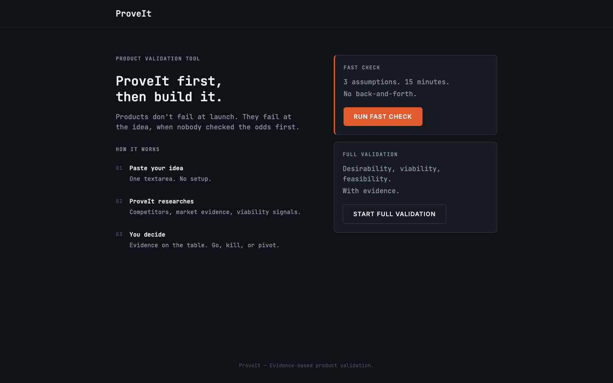

# ProveIt Web



ProveIt Web brings product validation to anyone without requiring Claude Code or a terminal. Paste a product idea and get evidence-backed assumption checks in under 90 seconds, or run a full conversational discovery session that walks through desirability, viability, and feasibility before producing a scored summary you can download.

## Two Modes

**Fast Check** — Single shot. Paste your idea, get three assumption verdict cards (Supported / Weak / Contradicted) with cited evidence in under 90 seconds. No conversation. Results are ephemeral — they don't persist across page refreshes by design.

**Full Validation** — Conversational. A chat interface guides you through a structured discovery loop: brain dump, targeted questions, live web research, scored findings. The session persists in localStorage so you can close the tab and resume later. At the end you download a `discovery.md` summary.

---

## Getting Started

### Prerequisites

- Node.js 20 or higher
- npm 10 or higher

### Setup

```bash
git clone https://github.com/clairedonald/proveit.git
cd proveit/web
npm install
```

Copy the example env file and add your API key:

```bash
cp .env.local.example .env.local
```

Open `.env.local` and set your key:

```
ANTHROPIC_API_KEY=sk-ant-...
```

Then start the dev server:

```bash
npm run dev
```

Open [http://localhost:3000](http://localhost:3000).

---

## Environment Variables

| Variable | Description | Required | Where to get it |
|----------|-------------|----------|-----------------|
| `ANTHROPIC_API_KEY` | Anthropic API key used server-side for all AI calls | Yes | [console.anthropic.com/settings/keys](https://console.anthropic.com/settings/keys) |

**Important — web search must be enabled:** Full Validation runs a live web research phase using Anthropic's native web search tool. This requires an admin on your Anthropic Console account to enable it at **Settings > Privacy > Web Search**. Without it, the research phase will fail. Fast Check does not require web search.

---

## Development

```bash
npm run dev        # Start local dev server at localhost:3000
npm run build      # Production build
npm run lint       # ESLint
npm run test       # Run tests in watch mode (vitest)
npm run test:run   # Run tests once
```

The test suite uses [Vitest](https://vitest.dev/) with React Testing Library. Tests live in `tests/unit/` and `tests/integration/`.

---

## Deployment

ProveIt Web deploys to Vercel from the `clairedonald/proveit` GitHub repo.

**Vercel configuration:**

1. Connect the `clairedonald/proveit` repo in Vercel.
2. Set the **Root Directory** to `web`.
3. Add `ANTHROPIC_API_KEY` to Vercel's environment variables (Production, Preview, and Development as needed).
4. Deploy.

The `vercel.json` at the root of `web/` handles build commands and output directory. No database setup is required — there is no database.

Route Handlers run in the Node.js runtime (not Edge). This is required because the Anthropic SDK uses Node.js built-ins. Do not switch Route Handlers to the Edge runtime.

---

## Project Structure

```
web/
├── src/
│   ├── app/                  # Next.js App Router routes
│   │   ├── page.tsx          # Home — idea input + mode selector
│   │   ├── fast/             # /fast — Fast Check result page
│   │   ├── validate/         # /validate — Full Validation chat
│   │   └── api/
│   │       ├── fast/         # POST /api/fast — single-shot check
│   │       └── chat/         # POST /api/chat — conversational turns
│   ├── components/
│   │   ├── home/             # IdeaInput, ModeSelector, ResumeSessionBanner
│   │   ├── fast/             # AssumptionCard, FastStream, StreamingIndicator
│   │   ├── validate/         # ChatInterface, ScorePanel, PhaseIndicator, DownloadButton
│   │   └── ui/               # shadcn/ui base components
│   ├── lib/
│   │   ├── anthropic.ts      # Anthropic client (server-only — never import in Client Components)
│   │   ├── session.ts        # All localStorage reads and writes
│   │   ├── prompts.ts        # System prompts for both modes
│   │   ├── streaming.ts      # Stream parsing utilities
│   │   ├── markdown.ts       # discovery.md generation for download
│   │   └── utils.ts          # Shared utilities (cn, etc.)
│   └── types/
│       └── index.ts          # All TypeScript interfaces and types
└── tests/
    ├── unit/                 # Component and utility unit tests
    └── integration/          # API route integration tests
```

---

## Tech Stack

- **Next.js 15** App Router (TypeScript)
- **React 19**
- **Tailwind CSS** + shadcn/ui components
- **Anthropic SDK** — server-side only, never bundled to the client
- **Zod** — input validation in Route Handlers
- **Vitest** + React Testing Library — 180 tests
- **No database** — session state lives in localStorage
- **No auth** — public, no user accounts
- **Vercel** — hosting and deployment

---

## Architecture Notes

A few things that are non-obvious and worth knowing before touching the code:

**The Anthropic client is server-only.** `src/lib/anthropic.ts` imports the `server-only` package, which throws a build error if accidentally imported from a Client Component. Keep it that way — the API key must never reach the browser.

**Streaming is a custom protocol, not SSE.** Both API routes stream `Content-Type: text/plain`. Structured events (phase changes, score updates, web search indicators) are injected as `data: {...}` JSON lines mixed into the plain text stream. The client reads line-by-line and routes accordingly. The Vercel AI SDK (`useChat`) is intentionally excluded — it buffers responses before yielding them, which breaks real-time streaming.

**Session state is client-side only.** The server is stateless. The client sends the full message history and current phase on every request. localStorage is the source of truth for Full Validation sessions. Fast Check results are not stored anywhere — they are intentionally ephemeral.

**Web search only activates in the research phase.** The `web_search_20250305` tool is included in the Anthropic request only when `phase === "research"`, with `max_uses: 12`. It is omitted for all other phases. The research phase is conditional — if discovery answers clearly indicate no real problem and no viable business, the model skips research and transitions directly to findings.

**Rate limiting is built in.** `/api/chat` allows 20 requests/IP/60s; `/api/fast` allows 10. Uses Upstash Redis when `UPSTASH_REDIS_REST_URL` and `UPSTASH_REDIS_REST_TOKEN` are set; falls back to in-memory for local/single-instance use.

**Fonts are self-hosted.** Inter and JetBrains Mono are loaded via `next/font/google`, which downloads them at build time and serves from the same origin. This keeps `font-src 'self'` in the CSP without needing to allow external font origins.

For full architecture detail, see [ARCHITECTURE.md](./ARCHITECTURE.md).
