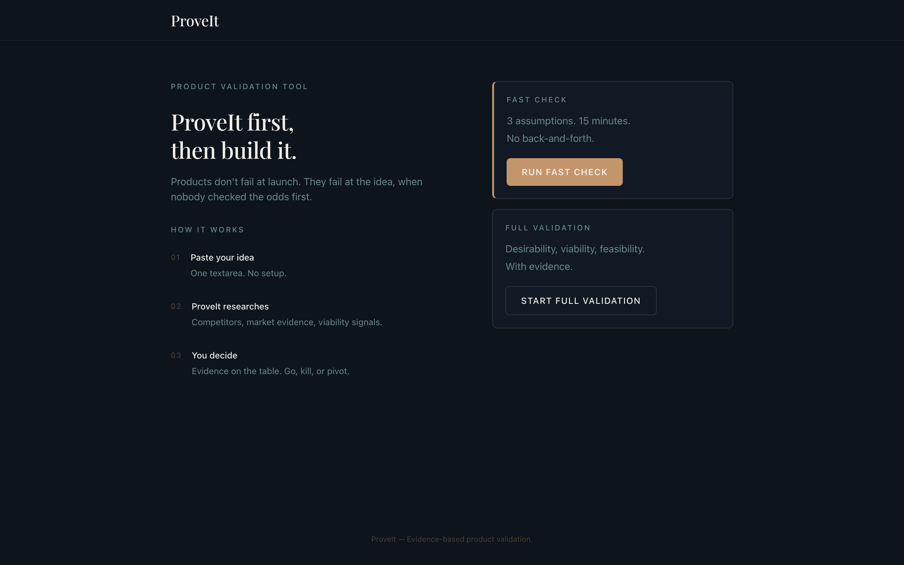

# ProveIt Web

> **Try it: [proveit-web-zeta.vercel.app](https://proveit-web-zeta.vercel.app)** — paste a product idea and get evidence-backed assumption checks in under 90 seconds.

ProveIt Web is the public-facing surface of [ProveIt](../README.md), a structured product validation tool for product managers. It puts the same methodology behind the Claude Code plugin in a browser, with no install or terminal required.

There are two modes: a 90-second **Fast Check** for an early-warning assumption scan, and a multi-turn **Full Validation** chat that walks through structured discovery, live web research, scored findings, and a downloadable summary.



---

## Two modes

### Fast Check

Single shot. Paste your idea, get three assumption verdict cards (Supported / Weak / Contradicted) with cited evidence in under 90 seconds. No conversation. Results are ephemeral by design — they don't persist across page refreshes. Useful as an early-warning scan before committing time to a full validation.

### Full Validation

Conversational. A chat interface guides you through:

1. **Brain dump** — get the idea out fast, no frameworks
2. **Discovery** — targeted questions across desirability, viability, feasibility
3. **Live web research** — competitor scan, market evidence, viability signals via Anthropic's native web search tool, with the search-query log shown live in the UI so the user can see what's being looked up
4. **Findings** — confidence scores, kill signals (when evidence supports them), recommendation
5. **Download** — a `discovery.md` summary you can paste into Linear, Notion, Slack, or anywhere

The session persists in localStorage so you can close the tab and resume later from the same browser.

---

## Tech stack

- **Next.js 15** (App Router) on **React 19**, TypeScript end-to-end
- **Anthropic SDK** server-side only — `server-only` import guard prevents accidental bundling to the client
- **Roami Design System** — vendored Deep Tay palette and Playfair Display / system-ui / Fira Code typography
- **Tailwind CSS v4** + shadcn/ui primitives
- **Zod** for input validation in route handlers
- **Upstash Redis** for distributed rate limiting (with an in-memory fallback for local dev only)
- **Vitest** + React Testing Library — 181 tests across unit + integration
- **Vercel** for hosting; Node.js runtime on the route handlers (Edge would break the Anthropic SDK)
- **No database, no auth** — server is stateless, session state lives in the browser

---

## Getting started

### Prerequisites

- Node.js ≥ 20
- npm ≥ 10

### Install + run

```bash
git clone https://github.com/cla1redonald/proveit.git
cd proveit/web
npm install
cp .env.local.example .env.local
```

Open `.env.local` and set:

```
ANTHROPIC_API_KEY=sk-ant-...
```

Then:

```bash
npm run dev
```

Open [http://localhost:3000](http://localhost:3000).

For local dev, Upstash isn't required — the in-memory rate limiter is sufficient. For any deployment beyond yourself, see [Production checklist](#production-checklist) below.

---

## Environment variables

| Variable | Required | Description | Where to get it |
|----------|----------|-------------|-----------------|
| `ANTHROPIC_API_KEY` | Always | Server-side Anthropic API key for all AI calls | [console.anthropic.com/settings/keys](https://console.anthropic.com/settings/keys) |
| `UPSTASH_REDIS_REST_URL` | Production | Upstash Redis REST endpoint for distributed rate limiting | [console.upstash.com/redis](https://console.upstash.com/redis) |
| `UPSTASH_REDIS_REST_TOKEN` | Production | Upstash Redis REST token | Same project as above |
| `DAILY_SPEND_CEILING_USD` | Recommended in production | Global daily Anthropic-spend ceiling. Default $5. When breached, `/api/chat` and `/api/fast` return 503 with a friendly message. | Pick a number you're willing to lose if abused |
| `PER_IP_DAILY_CEILING_USD` | Recommended in production | Per-IP daily Anthropic-spend ceiling. Default $1. Stops VPN-rotation by single users and casual abuse. | — |
| `SUPABASE_URL` | Recommended in production | Supabase project URL backing the waitlist (users who hit the spend cap and asked to be notified) | [supabase.com](https://supabase.com) |
| `SUPABASE_PUBLISHABLE_KEY` | Recommended in production | Supabase publishable / anon key. RLS on the waitlist table allows INSERT only — anon key cannot read or modify entries. | Same project as above |
| `RESEND_API_KEY` | Recommended in production | Resend API key for waitlist notification emails. Without it, submissions still land in Supabase but no email alert fires. | [resend.com](https://resend.com) — free tier 100 emails/day |
| `WAITLIST_NOTIFY_EMAIL` | Recommended in production | Address that receives the "new waitlist signup" notification email | Your own email |
| `WAITLIST_FROM_EMAIL` | Optional | From-address for notification emails. Defaults to `onboarding@resend.dev` (only delivers to your registered Resend email). Set to a verified-domain address once Resend domain verification is set up. | Resend dashboard |
| `ALLOWED_ORIGIN` | Optional | Override the CORS allowed origin (defaults to the request `Host`) | — |

**Web search must be enabled.** Full Validation runs a live web research phase using Anthropic's native web search tool. An admin on your Anthropic Console account must enable it at **Settings → Privacy → Web Search**, otherwise the research phase fails. Fast Check doesn't need it.

---

## Production checklist

Before exposing this to anyone beyond yourself:

- [x] **Anthropic API key** set in production environment variables
- [ ] **Upstash provisioned** and `UPSTASH_REDIS_REST_URL` + `UPSTASH_REDIS_REST_TOKEN` set. **Do not skip this.** The in-memory fallback is per-instance on serverless platforms — a single client can drain the Anthropic credit budget by issuing parallel requests across instances. Free tier (10K commands/day) is fine.
- [ ] **Daily spend ceilings configured** — `DAILY_SPEND_CEILING_USD` and `PER_IP_DAILY_CEILING_USD`. Caps blast radius of cost-spike abuse (viral distribution, VPN-rotation) that per-IP rate limiting alone can't catch. Defaults are $5 / $1 if unset; explicit values give you operational control. See [Architecture notes](#architecture-notes).
- [ ] **Web search enabled** on the Anthropic Console (Settings → Privacy → Web Search)
- [ ] **Smoke-test the live URL** after deploy: hit `POST /api/fast` with a real idea and confirm a streamed response with citations comes back. Don't trust "Aliased" output alone.

---

## Development

```bash
npm run dev        # Local dev server at localhost:3000
npm run build      # Production build
npm run lint       # ESLint
npm run test       # Vitest in watch mode
npm run test:run   # Vitest one-shot
```

Tests live in `tests/unit/` (component + utility tests) and `tests/integration/` (API route handler tests). The route handler tests mock the Anthropic SDK at module level via Vitest.

---

## Deployment

Deploys to Vercel from the `cla1redonald/proveit` repo with `web/` set as the project root.

1. Connect the repo in Vercel
2. Set **Root Directory** to `web`
3. Add the environment variables above (Production + Preview as needed)
4. Provision Upstash for Redis via the Vercel marketplace OR set the Upstash REST values manually
5. Deploy

The `web/vercel.json` declares the build/install commands. Route handlers run in Node.js (the Anthropic SDK uses Node built-ins; Edge runtime would break).

---

## Project structure

```
web/
├── src/
│   ├── app/
│   │   ├── page.tsx              # Home — entry-point cards (no idea input)
│   │   ├── globals.css           # ProveIt vars mapped onto Roami tokens
│   │   ├── roami-tokens.css      # Vendored Roami Design System tokens
│   │   ├── layout.tsx            # Loads Playfair Display + Fira Code
│   │   ├── fast/                 # /fast — Fast Check
│   │   ├── validate/             # /validate — Full Validation
│   │   └── api/
│   │       ├── fast/             # POST /api/fast — single-shot
│   │       └── chat/             # POST /api/chat — streaming conversation
│   ├── components/
│   │   ├── home/ResumeSessionBanner.tsx     # Reads localStorage, offers resume
│   │   ├── fast/                            # FastPageContent + FastInput + FastStream
│   │   │                                    # + AssumptionCard + StreamingIndicator
│   │   ├── validate/                        # ChatInterface + MessageList + UserMessage
│   │   │                                    # + AssistantMessage + StreamingText
│   │   │                                    # + ChatInput + PhaseIndicator
│   │   │                                    # + SearchingIndicator + ScorePanel
│   │   │                                    # + DownloadButton
│   │   └── ui/                              # shadcn/ui primitives (button, card, etc.)
│   ├── hooks/                               # useStream + useSession
│   ├── lib/
│   │   ├── anthropic.ts          # Anthropic client (server-only guard)
│   │   ├── prompts.ts            # System prompts for both modes
│   │   ├── rate-limit.ts         # Upstash + in-memory limiter, getClientIp
│   │   ├── streaming.ts          # Line-based stream parser
│   │   ├── markdown.ts           # discovery.md generator for download
│   │   ├── session.ts            # localStorage CRUD
│   │   └── utils.ts              # cn() + getRelativeTime
│   ├── middleware.ts             # Origin guard for /api/*
│   └── types/index.ts            # All shared TypeScript interfaces
└── tests/                        # Unit + integration (181 tests)
```

For the long-form architecture, see [`ARCHITECTURE.md`](./ARCHITECTURE.md).

---

## Architecture notes

A few non-obvious decisions worth knowing before touching the code:

**The Anthropic client is server-only.** `src/lib/anthropic.ts` imports the `server-only` package, which throws at build time if accidentally imported from a Client Component. Keep it that way — the API key must never reach the browser.

**Streaming uses `text/event-stream` but the body is not strict SSE.** Both API routes set `Content-Type: text/event-stream` plus `Cache-Control: no-transform` and `X-Accel-Buffering: no` to defend against CDN/proxy buffering. Structured events (phase changes, score updates, search-query echoes) are injected as `data: {...}` JSON lines mixed into the text stream. The client reads line-by-line — it does not use `EventSource`. The Vercel AI SDK (`useChat`) is intentionally excluded — it buffers responses before yielding, which breaks real-time streaming.

**Server is stateless. Client owns session state.** localStorage is the source of truth for Full Validation sessions. The client sends the full message history and current phase on every request. Fast Check results are intentionally ephemeral — not stored anywhere.

**Web search activates only in the research phase.** The `web_search_20250305` tool is included in the Anthropic request only when `phase === "research"`, with `max_uses: 12`. Anthropic SDK ≥ 0.50 delivers web-search invocations as `server_tool_use` content blocks (not `tool_use`); the route handler matches both shapes so the Searching indicator fires correctly.

**Rate limiting is built in — and Upstash is required for production.** `/api/chat` allows 20 requests per IP per 60s; `/api/fast` allows 10. The implementation uses Upstash Redis when the env vars are set, and falls back to an in-process sliding window otherwise. The fallback is per-instance and resets on cold start — on Vercel's serverless runtime this means parallel requests across instances effectively bypass the limiter, so a single client can drain the Anthropic credit budget. Always provision Upstash before exposing the deployment to any audience beyond yourself.

**Daily spend ledger / circuit breaker (v3.3, complementary to rate limiting).** Per-IP rate limiting handles single-machine abuse. It does NOT stop viral distribution (1000 strangers from a Reddit link) or VPN-rotation. The spend ledger (`src/lib/spend-ledger.ts`) tracks estimated daily Anthropic spend at two layers — global and per-IP — and returns 503 when either ceiling is breached. Cost is estimated per call (Fast = $0.10, chat without research = $0.05, chat in research phase = $0.50, brain_dump with web_search = $0.10) since Anthropic doesn't surface dollar cost in responses. Ceilings come from env (`DAILY_SPEND_CEILING_USD` default $5, `PER_IP_DAILY_CEILING_USD` default $1) so you can change them without redeploying. Backed by the same Upstash instance as the rate limiter; falls open on Upstash errors (better to over-spend a few dollars than block all users on a transient hiccup).

**Client IP detection trusts `x-real-ip` first, then the LAST entry of `x-forwarded-for`.** Never the first entry of `x-forwarded-for` — that's user-controlled and trivially spoofed. The last entry is the address Vercel's edge actually saw.

**Roami Design System.** The palette and typography are vendored from `@roami/design-system` v1.1.0 into `src/app/roami-tokens.css`. The existing ProveIt CSS variable names (`--bg-base`, `--text-primary`, `--color-accent`) are preserved and now resolve to Roami values, so component code is unchanged. Playfair Display is used for the wordmark and the home hero; system-ui for body and UI; Fira Code is reserved for genuinely technical content (search-query echoes, code blocks).

---

## Relationship to the plugin

The plugin (`/proveit` in [Claude Code](https://claude.ai/download)) and this web app share methodology. As of v3.2 (2026-05-10), the methodology is **largely in sync** at the prompt layer; the plugin still leads on infrastructure-heavy phases.

**In sync (web app matches plugin v3.2 methodology):**
- **Phase 0 Intake** — Full Validation now opens with the context-type (new vs iteration) + prior-context (URLs / docs) intake. The model has limited web search access (3 uses) during `brain_dump` to fetch any URLs the user pastes.
- **Adaptive Fast Check** — Fast Check picks 3 from a 7-category catalog (Desirability, Viability, Competition, Distribution, Defensibility, AI Commoditization, Regulatory) per idea profile, instead of a hardcoded D/V/C default.
- **Framework anchoring** — discovery and findings prompts cite named expert anchors (Bob Moesta, Teresa Torres, Madhavan Ramanujam, Annie Duke, Sean Ellis, Marty Cagan, Shreyas Doshi, Dalton Caldwell).
- **Live Bets / kill criteria** — findings phase produces 3 critical bets the PM is making, each with a falsification test and pass criteria. Annie Duke / Shreyas Doshi pre-mortem framing applied.
- **Handoff guidance** — complete phase points at claude.ai/design canvas, downstream engineering, and the plugin for full-depth validation.

**Plugin-only (still gated on the strategic product decision in #20):**
- Multi-agent Deep Dive swarm (10 parallel adversarial agents)
- Cross-Model Review via OpenAI o3
- Wave 3 — Scenario & Experiment phase with paste-ready experiment artefacts
- In-session BrandIt (full brand identity generation)
- Gamma deck output (Phase 9 Output 1)
- Engineering `spec.md` PRD output (Phase 9 Output 3)
- Lenny's Podcast MCP integration (runtime PM expert priors)
- Calendar kill dates on bets (the web is single-session; no persistent date tracking yet)

The web app exists for evaluators and PMs without Claude Code installed. For full-depth validation including swarm + Gamma + spec, run the plugin.

---

## License

MIT — see [LICENSE](../LICENSE).
